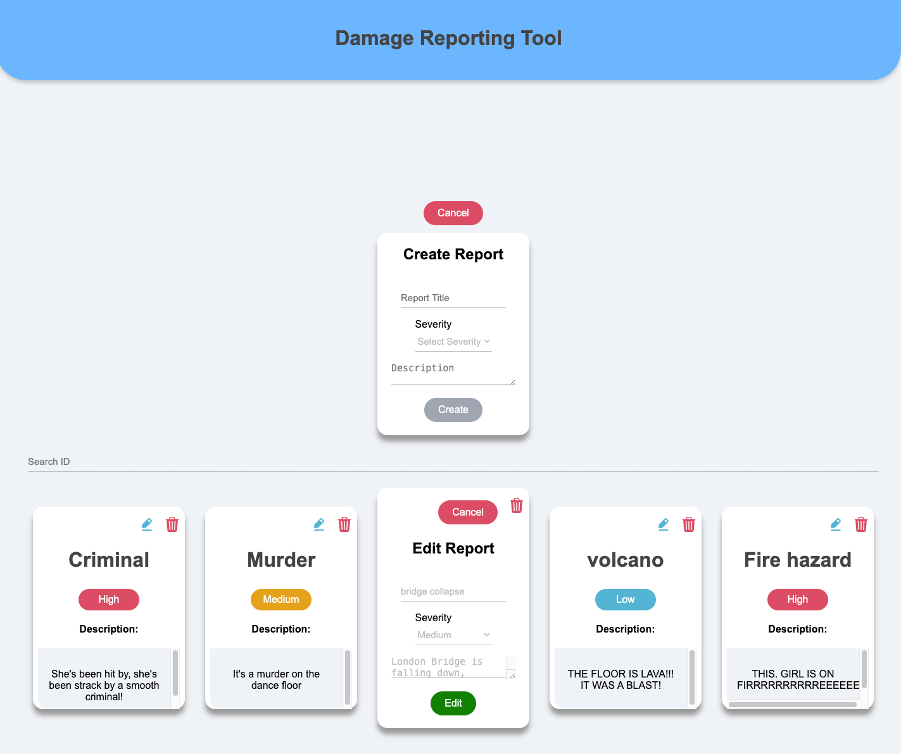

# Damage Reporting Tool (React)
This is a simple damage reporting tool built with React. It allows users to report damage to a property and view a list of reported damages.

## Installation
1. Clone the repository
```
git clone https://github.com/ronyzrihen/react-damage-reporting-tool.git
```
2. Install dependencies
```
npm install
```
3. Run the app
```
npm start
```
4. Click on the link in the terminal to open the app in your browser.

## Backend
The backend for this app is built with Node.js and Express. You can find the repository [here](https://github.com/ronyzrihen/express-reporting-tool.git).

## Features
functionalities include:
- Report damage to a property
- View a list of reported damages
- Search for a specific damage report
- Delete a damage report
- Edit a damage report

designed with:
- React
- Styled-components
- styled-icons

## Usage
### create a damage report:
1. Click on the "Create" button to report damage to a property.
2. Fill in the form with the required information and click "Create".
3. If you want to cancel the report, click "Cancel".
4. **Note:** All fields are required before submitting the form.
5. **Note:** The Title field is limited to 13 characters.

### view and search reported damages:
1. view a list of reported damages in the main page.
2. Search for a specific damage report by typing in the search bar.

### delete a damage report:
1. Click on the "Delete" icon one the report that you want to delete.

### edit a damage report:
1. Click on the "Edit" icon one the report that you want to edit.
2. Edit the form with the required information and click "Update".
3. If you want to cancel the report, click "Cancel".
4. **Note:** All fields are required before submitting the form.


## Figma Design
You can find the Figma design [here](https://www.figma.com/file/R3opkRdGbJ1Phfu0H0GoEf/Untitled?type=design&node-id=0%3A1&mode=dev&t=4CmzlKLZZ54ehkjL-1)    

